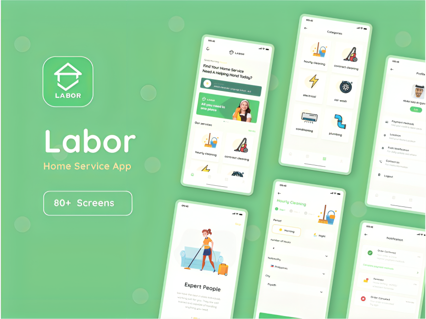

# 🏠 Home Services – Laravel API Project

**Home Services** is a modern backend API built with **Laravel (PHP)** for a platform that connects clients with freelancers for home-related services such as cleaning, electrical repairs, plumbing, and more. The system supports multi-role access, real-time communication, secure authentication, and notification handling.

---

## 📸 Screenshots

<p align="center">
    
</p>

---


## 🛠️ Tech Stack

- **PHP Laravel** – Backend Framework  
- **MySQL** – Database  
- **Laravel Sanctum** – API Authentication  
- **Vonage API** – Phone OTP Login  
- **Laravel Socialite** – Google Login  
- **Pusher** – Real-time chat  
- **Firebase Cloud Messaging (FCM)** & **OneSignal** – Notifications  
- **Queues & Jobs** – For async emails and notifications  
- **Hostinger** – Deployment & Hosting

---

## ✨ Features

### ✅ General Features

- Multi-role system: **Clients**, **Freelancers**, **Admins**
- Secure authentication via **Phone OTP** and **Google Login**
- Real-time **chat** and **push notifications**
- Smart **email system** using **queues**
- Hosted live on **Hostinger**

---

### 👤 Client & Freelancer Features

- Register/Login via Phone or Google  
- Create and manage **service orders**  
- View, update, and rate **profiles**  
- Receive **notifications** and **emails**  
- Real-time chat with each other  

---

### 🔧 Admin Dashboard Features

- Manage **categories** and **orders**
- View and manage **clients** and **freelancers**
- Full control over the platform data

---

## ⚙️ API Middleware & Enhancements

- **Request throttling** to prevent abuse  
- **Pagination** for large dataset responses  
- **Structured JSON responses** with status codes  
- **Role-based authorization** and route protection

---

## 📦 Installation & Setup

1. **Clone the repository**
   ```bash
   git clone https://github.com/your-repo/homeservices-api.git
   cd homeservices-api
   ```

2. **Install dependencies**
   ```bash
   composer install
   ```

3. **Set up `.env`**
   ```bash
   cp .env.example .env
   php artisan key:generate
   ```

4. **Update `.env` with your credentials**
   - DB (MySQL)
   - Vonage (OTP)
   - Firebase & OneSignal (Notifications)
   - Mail (SMTP)
   - Google OAuth

5. **Run migrations**
   ```bash
   php artisan migrate
   ```

6. **(Optional) Seed initial roles/categories**
   ```bash
   php artisan db:seed
   ```

7. **Start the development server**
   ```bash
   php artisan serve
   ```

---

## 🔐 Authentication Notes

- Phone login requires **Vonage** credentials and setup.
- Google login uses **Laravel Socialite**, be sure to set the Google Client ID and Secret in `.env`.
- API tokens handled via **Laravel Sanctum**.

---

## 🔔 Notifications

- **FCM**: For app/browser push notifications  
- **OneSignal**: Used for web push notifications  
- **Queue Jobs**: Handle delayed email/send notifications asynchronously

---

## 🧪 Testing the API

You can use tools like **Postman** or **Insomnia** to test endpoints. Example headers:

```http
Authorization: Bearer YOUR_TOKEN
Accept: application/json
```

---

## 🌐 Deployment

- Deployed to **Hostinger**
- `.env` configured for production
- Queue workers and cron jobs set up for emails and push


